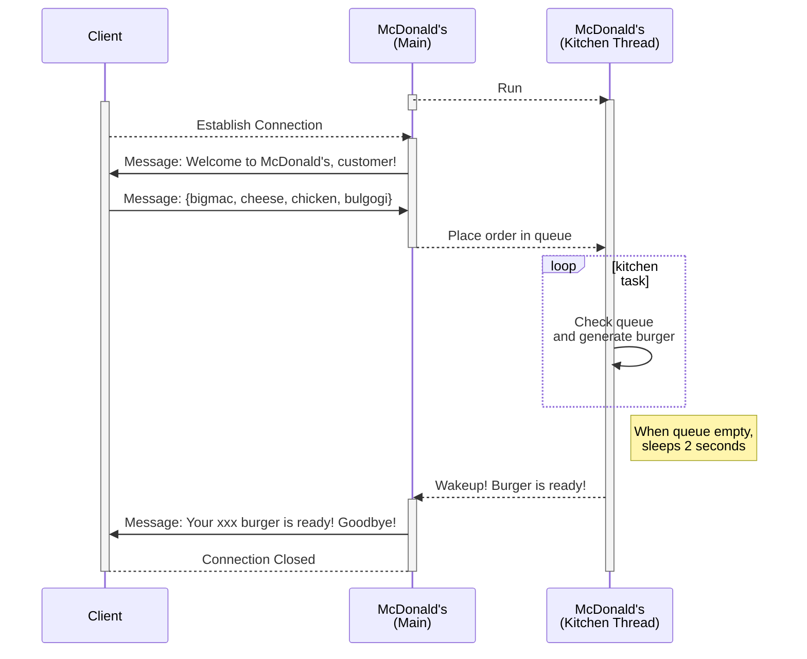
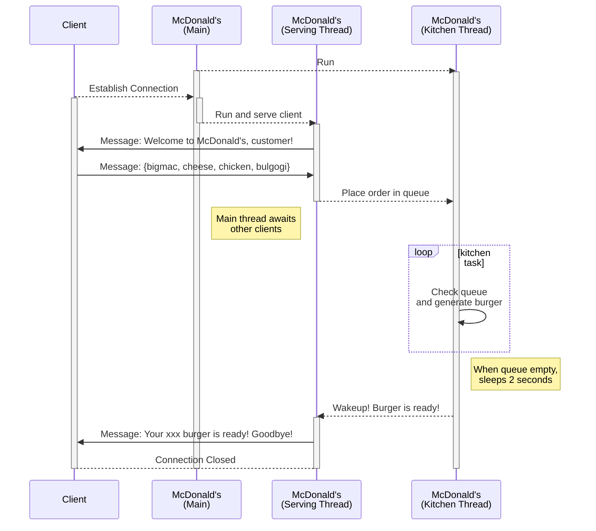

# Lab 6: Network

In this lab, we implement a tool that handles network clients.

You will learn
   * how to communicate under TCP/IP network environment.
   * how to assure atomicity on critical sections between threads.
   * how to limit the number of the clients on listening socket.

[[_TOC_]]


## Important Dates

This lab requires a total of four submissions: milestone 1, milestone 2, milestone 3, and milestond 4 (final submission). Make sure to keep all deadlines.

| Date | Description |
|:---  |:--- |
| Wednesday, November 24 | Hand-out |
| Wednesday, December 1 | Lab session 1 |
| Thursday, December 2 | Milestone 1 deadline |
| Wednesday, December 8 | Lab session 2 & Milestone 2 deadline |
| Friday, December 10 | Milestone 3 deadline |
| Sunday, December 12 | Submission deadline |


## Logistics

### Hand-out

Start by forking the lab into your namespace and making sure the lab visibility is set to private. Read the instructions here carefully. Then clone the lab to your local computer and get to work.

### Submission

Commit and push your fork frequently to avoid data loss. For this lab you should create a tag for each milestone that we prepared in [Your Task](#milestone). Make sure to check the dates and name. We decided to do this to make sure that the lab is not done the last day.

To create a tag, go to your Network lab repository on https://teaching.csap.snu.ac.kr/ and navigate to Repository -> Tags. Enter the milestone name tag as the Tag name then hit "Create tag". You can leave the other fields empty.

If you later discover an error and want to update your submission, you can delete the tag, fix your solution, and create a new tag. If that happens _after_ the submission deadline, you also need to email the TAs so that they are aware of the update to your submission.


## McDonald's Overview

_mcdonalds_ is a simple socket-based server tool that serves clients. McDonalds server repeatedly listens and accepts clients until a _SIGINT_ signal (Ctrl+C) is received. On exit, it prints out statistics regarding how it worked.

### Socket Interface

```
        Client                         Server
    +-------------+               +-------------+   
    | getaddrinfo |               | getaddrinfo |
    +-------------+               +-------------+
           |                             |
           v                             v
    +-------------+               +-------------+
    |    socket   |               |    socket   |
    +-------------+               +-------------+
           |                             |
           |                             v
           |                      +-------------+
           |                      |     bind    |
           |                      +-------------+
           |                             |
           |                             v
           |                      +-------------+
           |                      |    listen   |
           |                      +-------------+
           |                             |
           v         Connection          v
    +-------------+    request    +-------------+   Await connection
    |   connect   |- - - - - - - >|    accept   |   request from next client (blocking)
    +-------------+               +-------------+
           |                             |
           v                             v
    +-------------+               +-------------+
 /->|     send    |-------------->|     recv    |<-\
 |  +-------------+               +-------------+  |
 |         |                             |         |
 |         v                             v         |
 |  +-------------+               +-------------+  |
 \--|     recv    |-------------->|     send    |--/
    +-------------+               +-------------+
           |                             |
           v                             v
    +-------------+      EOF      +-------------+
    |    close    |- - - - - - - >| recv (fail) |
    +-------------+               +-------------+
                                         |
                                         v
                                  +-------------+
                                  |    close    |
                                  +-------------+
```
## McDonalds Specification

### Operation

0. Before accepting clients, server initializes kitchen thread(s).
1. Establish socket and awaits connection request from the client
2. Once a single connection has been initiated, a dedicated thread serves the client.
3. Server sends the client a welcome message.
4. Client now orders a burger by sending the burger name to the server. Our _mcdonalds_ only supports 4 burgers: bigmac, cheese, chicken, bulgogi.
5. When the server receives the name of the burger from the client, it places the order in the queue and sleeps. If the burger is not available, close the connection.
6. Background kitchen thread(s) repeatedly check the queue and cooks the burger for 5 seconds if any item is available in the queue.
7. After when the burger is ready, kitchen threads wake up the thread that filed the order.
8. The server is now ready to hand the burger and say goodbye to the client.
9. Socket connections are closed on both sides.
10. When Ctrl+C (SIGINT) is pressed, kitchen thread(s) will close, and terminate with simple statistics when pressed again.

### Communication Protocol
#### Single-threaded


#### Multi-threaded


### Client Program

Client generates connection request(s) to the server _mcdonalds_. It accepts number of clients to generate as input. Each thread will request the server a burger that was randomly chosen.

```
client [NumThreads]
```

### Output

#### Server
When you first execute the program, you will see:
```
$ mcdonalds
@@@@@@@@@@@@@@@@@@@@@@@@@@@@@@@@@@@@@@@@@@@@@@@@@@@@@@@@@@@@@@@@@@@@@@@@@@@@@@@@@
@@@@@@@@@@@@@@@@@(,,,,,,,,,,,@@@@@@@@@@@@@@@@@@@@@@@,,,,,,,,,,,(@@@@@@@@@@@@@@@@@
@@@@@@@@@@@@@@@,,,,,,,,,,,,,,,,,@@@@@@@@@@@@@@@@@,,,,,,,,,,,,,,,,,@@@@@@@@@@@@@@@
@@@@@@@@@@@@@,,,,,,,@@@@@@,,,,,,,@@@@@@@@@@@@@@(,,,,,,@@@@@@@,,,,,,,@@@@@@@@@@@@@
@@@@@@@@@@@@,,,,,,@@@@@@@@@@,,,,,,,@@@@@@@@@@@,,,,,,,@@@@@@@@@*,,,,,,@@@@@@@@@@@@
@@@@@@@@@@.,,,,,,@@@@@@@@@@@@,,,,,,,@@@@@@@@@,,,,,,,@@@@@@@@@@@@,,,,,,/@@@@@@@@@@
@@@@@@@@@,,,,,,,,@@@@@@@@@@@@@,,,,,,,@@@@@@@,,,,,,,@@@@@@@@@@@@@,,,,,,,,@@@@@@@@@
@@@@@@@@,,,,,,,,@@@@@@@@@@@@@@@,,,,,,,@@@@@,,,,,,,@@@@@@@@@@@@@@@,,,,,,,,@@@@@@@@
@@@@@@@@,,,,,,,@@@@@@@@@@@@@@@@,,,,,,,,@@@,,,,,,,,@@@@@@@@@@@@@@@@,,,,,,,@@@@@@@@
@@@@@@@,,,,,,,,@@@@@@@@@@@@@@@@@,,,,,,,,@,,,,,,,,@@@@@@@@@@@@@@@@@,,,,,,,,@@@@@@@
@@@@@@,,,,,,,,@@@@@@@@@@@@@@@@@@,,,,,,,,,,,,,,,,,@@@@@@@@@@@@@@@@@@,,,,,,,,@@@@@@
@@@@@,,,,,,,,,@@@@@@@@@@@@@@@@@@@,,,,,,,,,,,,,,,@@@@@@@@@@@@@@@@@@@,,,,,,,,,@@@@@
@@@@@,,,,,,,,@@@@@@@@@@@@@@@@@@@@,,,,,,,,,,,,,,,@@@@@@@@@@@@@@@@@@@@,,,,,,,,@@@@@
@@@@,,,,,,,,,@@@@@@@@@@@@@@@@@@@@,,,,,,,,,,,,,,@@@@@@@@@@@@@@@@@@@@@,,,,,,,,,@@@@
@@@@,,,,,,,,,@@@@@@@@@@@@@@@@@@@@@,,,,,,,,,,,,,@@@@@@@@@@@@@@@@@@@@@,,,,,,,,,@@@@
@@@,,,,,,,,,@@@@@@@@@@@@@@@@@@@@@@,,,,,,,,,,,,,@@@@@@@@@@@@@@@@@@@@@@,,,,,,,,,@@@
@@@,,,,,,,,,@@@@@@@@@@@@@@@@@@@@@@,,,,,,,,,,,,,@@@@@@@@@@@@@@@@@@@@@@,,,,,,,,,@@@
@@@,,,,,,,,,@@@@@@@@@@@@@@@@@@@@@@@,,,,,,,,,,,@@@@@@@@@@@@@@@@@@@@@@@,,,,,,,,,@@@
@@,,,,,,,,,,@@@@@@@@@@@@@@@@@@@@@@@,,,,,,,,,,,@@@@@@@@@@@@@@@@@@@@@@@,,,,,,,,,,@@
@@,,,,,,,,,,@@@@@@@@@@@@@@@@@@@@@@@,,,,,,,,,,,@@@@@@@@@@@@@@@@@@@@@@@,,,,,,,,,,@@
@@,,,,,,,,,@@@@@@@@@@@@@@@@@@@@@@@@,,,,,,,,,,,@@@@@@@@@@@@@@@@@@@@@@@@,,,,,,,,,@@
@,,,,,,,,,,@@@@@@@@@@@@@@@@@@@@@@@@,,,,,,,,,,,@@@@@@@@@@@@@@@@@@@@@@@@,,,,,,,,,,@
@,,,,,,,,,,@@@@@@@@@@@@@@@@@@@@@@@@,,,,,,,,,,,@@@@@@@@@@@@@@@@@@@@@@@@,,,,,,,,,,@
@,,,,,,,,,,@@@@@@@@@@@@@@@@@@@@@@@@,,,,,,,,,,,@@@@@@@@@@@@@@@@@@@@@@@@,,,,,,,,,,@
@,,,,,,,,,,@@@@@@@@@@@@@@@@@@@@@@@@,,,,,,,,,,@@@@@@@@@@@@@@@@@@@@@@@@@,,,,,,,,,,@
@,,,,,,,,,,@@@@@@@@@@@@@@@@@@@@@@@@,,,,,,,,,,@@@@@@@@@@@@@@@@@@@@@@@@@,,,,,,,,,,@
@,,,,,,,,,,@@@@@@@@@@@@@@@@@@@@@@@@@@@@@@@@@@@@@@@@@@@@@@@@@@@@@@@@@@@,,,,,,,,,,@
@,,,,,,,,,,@@@@@@@@@@@@@@@@@@@@@@@@@@@@@@@@@@@@@@@@@@@@@@@@@@@@@@@@@@@,,,,,,,,,,@

                          I'm lovin it! McDonald's
Kitchen thread 140098072507968 ready
Kitchen thread 140098047329856 ready
Kitchen thread 140098055722560 ready
Kitchen thread 140098038937152 ready
Kitchen thread 140098064115264 ready
Listening...
```
When the program _client_ is executed:
```
Customer #0 visited
Customer #1 visited
Customer #2 visited
Customer #3 visited
Customer #4 visited
Customer #5 visited
Customer #6 visited
Customer #7 visited
Customer #8 visited
Customer #9 visited
[Thread 140098072507968] generating bulgogi burger
[Thread 140098038937152] generating cheese burger
[Thread 140098064115264] generating chicken burger
[Thread 140098055722560] generating bigmac burger
[Thread 140098047329856] generating chicken burger
[Thread 140098072507968] bulgogi burger is ready
[Thread 140098072507968] generating chicken burger
[Thread 140098038937152] cheese burger is ready
[Thread 140098064115264] chicken burger is ready
[Thread 140098064115264] generating cheese burger
[Thread 140098038937152] generating bulgogi burger
[Thread 140098047329856] chicken burger is ready
[Thread 140098047329856] generating chicken burger
[Thread 140098055722560] bigmac burger is ready
[Thread 140098055722560] generating bigmac burger
[Thread 140098072507968] chicken burger is ready
[Thread 140098064115264] cheese burger is ready
[Thread 140098038937152] bulgogi burger is ready
[Thread 140098047329856] chicken burger is ready
[Thread 140098055722560] bigmac burger is ready
```
When you want to terminate the program first press Ctrl+C (SIGINT) to terminate all the kitchen threads
```
^C****** I'm tired, closing McDonald's ******
[Thread 140098055722560] terminated
[Thread 140098038937152] terminated
[Thread 140098047329856] terminated
[Thread 140098064115264] terminated
[Thread 140098072507968] terminated
```

Now you are ready to close the program. Press Ctrl+C again to terminate the server completely.
```
^C
====== Statistics ======
Number of customers visited: 10
Number of bigmac burger made: 2
Number of cheese burger made: 2
Number of chicken burger made: 4
Number of bulgogi burger made: 2
```

#### Client
```
$ client 10
[Thread 140023404664384] From server: Welcome to McDonald's, customer #0
[Thread 140023404664384] To server: Can I have a bulgogi burger?
[Thread 140023315822144] From server: Welcome to McDonald's, customer #1
[Thread 140023315822144] To server: Can I have a cheese burger?
[Thread 140023273858624] From server: Welcome to McDonald's, customer #5
[Thread 140023307429440] From server: Welcome to McDonald's, customer #3
[Thread 140023307429440] To server: Can I have a chicken burger?
[Thread 140023299036736] From server: Welcome to McDonald's, customer #6
[Thread 140023299036736] To server: Can I have a bigmac burger?
[Thread 140023273858624] To server: Can I have a chicken burger?
[Thread 140023265465920] From server: Welcome to McDonald's, customer #7
[Thread 140023265465920] To server: Can I have a chicken burger?
[Thread 140023290644032] From server: Welcome to McDonald's, customer #8
[Thread 140023290644032] To server: Can I have a bulgogi burger?
[Thread 140023282251328] From server: Welcome to McDonald's, customer #4
[Thread 140023282251328] To server: Can I have a cheese burger?
[Thread 140023396271680] From server: Welcome to McDonald's, customer #2
[Thread 140023396271680] To server: Can I have a chicken burger?
[Thread 140023181604416] From server: Welcome to McDonald's, customer #9
[Thread 140023181604416] To server: Can I have a bigmac burger?
[Thread 140023273858624] From server: Your chicken burger is ready! Goodbye!
[Thread 140023315822144] From server: Your cheese burger is ready! Goodbye!
[Thread 140023404664384] From server: Your bulgogi burger is ready! Goodbye!
[Thread 140023307429440] From server: Your chicken burger is ready! Goodbye!
[Thread 140023299036736] From server: Your bigmac burger is ready! Goodbye!
[Thread 140023265465920] From server: Your chicken burger is ready! Goodbye!
[Thread 140023282251328] From server: Your cheese burger is ready! Goodbye!
[Thread 140023290644032] From server: Your bulgogi burger is ready! Goodbye!
[Thread 140023396271680] From server: Your chicken burger is ready! Goodbye!
[Thread 140023181604416] From server: Your bigmac burger is ready! Goodbye!
```

## Handout Overview

The handout contains the following files and directories

| File/Directory | Description |
|:---  |:--- |
| client.c | Client-side implemention |
| doc/ | Doxygen instructions, configuration file, and auto-generated documentation |
| README.md | this file |
| Makefile | Makefile mcdonalds |
| .gitignore | Tells git which files to ignore |
| mcdonalds.c | The McDonald's server. A skeleton is provided. Implement your solution by editing this file. |
| net.c/h | Network helper functions for the lab |
| reference/ | Reference implementation |


##<a name="milestone"></a> Your Task
Your task is to implment this lab according to the specification above. The lab is divided in different milestons that should be completed before the day of the deadline. 

### Part A (Tag: Milestone 1, deadline: Thursday, December 2, 14:00)
The first functionality to be implemented will be the to start the client thread.
The client thread will be in charge of each client we create. The thread is already implemented in `client.c` as `thread_task()`. One helpful thing
to do before connecting to the server and checking the threads are well started is to print the client number or anything recognizable inside
the `thread_task()`. Making sure the threads are working before connecting to the server will simplify the rest of the lab implementation.
After the thread implementation this task should also have the socket communication, just communication.
The skeleton provides some structures, global variables and macros that we think will be helpful. Start by working on `start_server()` in `mcdonalds.c` and `thread_task()` in `client.c`. Make sure that the code on your server and client follows basic socket connection procedure that you've learned from the lecture. Helper functions in `net.c/h` will help you use socket connection easily.

### Part B (Tag: Milestone 2, deadline: Wednesday, December 8, 23:59)
The objective of part B is to implement the kitchen functionality.
For this part you should only focus in the `serve_client()` function. This function is missing the functionality of how to get the order from the client, the parsing of the order and sending the order to the kitchen and wait to be ready. After this implementation the server should work correctly for one client.

### Part C (Tag: Milestone 3, deadline: Friday, December 10, 14:00)
Server from part B cannot serve multiple requests simultaneously. For efficiency, we now want to extend this server to work in a multi-threaded way. Currently, we can only serve one client and have only a single kitchen thread. In this part, your implementation must support multiple clients while having 5 kitchen threads in the background. Beware of critical sections - atomicity must be assured to some shared data structures.

### Part D (Tag: Milestone 4, deadline: December 12, 14:00)
COVID-19 is still going strong after two years since the first occurrence. To prevent further spreading the virus, most of the countries apply social distancing rules. We now want to apply the same rule for our server. Limit the number of customers in the waiting queue by 20. If any customer arrives when the queue is full, decline the connection.

## Hints

### Lecture Nodes & Skeleton code
These two materials may give you some hints about how you can start the lab.

### C library calls

To give you some insight, we provide a list of C library calls that you might find helpful to solve this lab. Read the man pages carefully to learn how exactly the functions operate.

<table>
  <thead>
    <tr>
      <th align="left">Topic</th>
      <th align="left">C library call</th>
      <th align="left">Description</th>
    </tr>
  </thead>
  <tbody>
    <tr>
      <td rowspan="3">
        String operations
      </td>
      <td>
        <code>asprintf()</code>
      </td>
      <td>
        print into a string and allocate memory for it at the same time
      </td>
    </tr>
    <tr>
      <td>
        <code>strtok()</code>
      </td>
      <td>
        tokenize string by delimiter
      </td>
    </tr>
    <tr>
      <td>
        <code>strncmp()</code>
      </td>
      <td>
        compare two strings by n characters
      </td>
    </tr>
  </tbody>
      <tr>
      <td rowspan="9">
        Concurrent programming
      </td>
      <td>
        <code>pthread_create()</code>
      </td>
      <td>
        create a new thread
      </td>
    </tr>
    <tr>
      <td>
        <code>pthread_detach()</code>
      </td>
      <td>
        detach a thread
      </td>
    </tr>
    <tr>
      <td>
        <code>pthread_exit()</code>
      </td>
      <td>
        terminate the calling thread
      </td>
    </tr>
    <tr>
      <td>
        <code>pthread_mutex_init()</code>
      </td>
      <td>
        create a mutex
      </td>
    </tr>
    <tr>
      <td>
        <code>pthread_mutex_lock()</code>
      </td>
      <td>
        lock a mutex
      </td>
    </tr>
    <tr>
      <td>
        <code>pthread_mutex_unlock()</code>
      </td>
      <td>
        unlock a mutex
      </td>
    </tr>
    <tr>
      <td>
        <code>pthread_cond_init()</code>
      </td>
      <td>
        create a condition variable
      </td>
    </tr>
    <tr>
      <td>
        <code>pthread_cond_wait()</code>
      </td>
      <td>
        wait on a condition variable
      </td>
    </tr>
    <tr>
      <td>
        <code>pthread_cond_signal()</code>
      </td>
      <td>
        unblock a thread waiting for a condition variable
      </td>
    </tr>
  </tbody>
</table>

## Final words

Network & concurrent programming is not an easy task. We don't know exactly how it will behave and therefore makes it hard to debug. Start working on lab early and actively consult TAs if you seek any assistance.

<div align="center" style="font-size: 1.75em;">

**Happy coding!**
</div>
